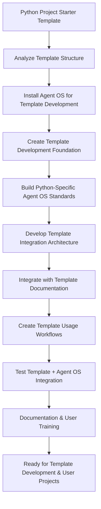

# Spec Requirements Document

> Spec: Agent OS Integration for Python Project Starter Template
> Created: 2025-07-30
> Status: Planning

## Executive Summary

**Prompt for Future Reuse:**
```
Set up buildermethods Agent OS (https://github.com/buildermethods/agent-os) for this Python project starter template repository with comprehensive template development and user integration capabilities. Execute the following implementation with logical task dependency ordering:

TASK DEPENDENCY ORDERING STANDARD:
- All implementation tasks must follow logical dependency ordering where prior tasks are always applicable (if logical) to subsequent tasks
- Each task builds upon the achievements of previous tasks
- Task dependencies must be explicitly documented
- Foundation tasks (like system installation) come before dependent tasks (like template integration)
- This ordering minimizes errors, reduces rework, and ensures consistent implementation success across different team members and environments

IMPLEMENTATION STEPS:

1. INSTALL AGENT OS FOR TEMPLATE DEVELOPMENT:
   Prerequisites: None - Foundation task
   - Install the framework at system level for template development workflow
   - Configure system-level paths, environment variables, and shell integration for Python template development
   - Set up Agent OS directory structure for template repository development
   - Validate system installation with template development compatibility tests

2. ANALYZE EXISTING PYTHON TEMPLATE STRUCTURE:
   Depends on: Task 1 - System installation required to run @analyze-product
   - Run: @analyze-product "I want to install Agent OS in this Python project starter template"
   - Document current template structure, Python tooling integration, and project generation workflow
   - Identify integration points for Agent OS with template architecture and user workflow
   - Create comprehensive analysis report for template repository integration

3. CREATE TEMPLATE DEVELOPMENT FOUNDATION:
   Depends on: Task 2 - Analysis results guide foundation setup
   - Create .agent-os/product/ directory structure with mission.md, roadmap.md, tech-stack.md, decisions.md
   - Configure repository-level settings for template development workflow
   - Set up Python-specific Agent OS standards for template development context
   - Always use /create-spec for specs and user stories related to template features and Python project generation

4. BUILD PYTHON-SPECIFIC AGENT OS STANDARDS:
   Depends on: Task 3 - Foundation structure required for standards creation
   - Create code-style.md aligned with modern Python tooling (black, isort, mypy, ruff)
   - Create tech-stack.md reflecting uv, pyproject.toml, pytest, and Python packaging ecosystem
   - Create best-practices.md for contemporary Python development patterns
   - Configure standards for seamless integration with template's Python tooling approach

5. DEVELOP TEMPLATE INTEGRATION ARCHITECTURE:
   Depends on: Task 4 - Standards must exist before template integration
   - Create template-files/.agent-os/ directory structure for new project inclusion
   - Build template copying mechanisms for Agent OS files to new Python projects
   - Implement customization interface for users to modify Agent OS standards
   - Configure template generation workflow to include Agent OS automatically

6. INTEGRATE WITH EXISTING TEMPLATE DOCUMENTATION:
   Depends on: Task 5 - Template architecture required before documentation integration
   - Update README.md to include Agent OS usage instructions for template users
   - Add Agent OS workflow documentation to existing docs/ directory structure
   - Create CLAUDE.md file with Agent OS integration and template-specific instructions
   - Ensure documentation clearly separates template development from template usage workflows

7. CREATE TEMPLATE USAGE WORKFLOWS:
   Depends on: Task 6 - Documentation must be established before workflow creation
   - Build script to copy Agent OS files to new projects during template instantiation
   - Create validation mechanisms for Agent OS setup in newly created Python projects
   - Implement user customization workflows for Agent OS standards in new projects
   - Configure seamless integration between template creation and Agent OS activation

8. TESTING AND VALIDATION:
   Depends on: Task 7 - All components must be implemented before comprehensive testing
   - Write comprehensive tests for template development workflow using Agent OS
   - Test new project creation with Agent OS included and properly configured
   - Validate existing Python tooling (uv, pytest, pyproject.toml management) continues to work
   - Test customization workflows and user modification of Agent OS standards

9. DOCUMENTATION AND USER TRAINING:
   Depends on: Task 8 - System must be tested and validated before documentation
   - Document template development procedures using Agent OS workflows
   - Create user guide for Python developers using template with Agent OS included
   - Provide customization documentation for modifying Agent OS standards in new projects
   - Create migration guide for existing projects to adopt Agent OS from this template

DELIVERABLES:
- Fully integrated Agent OS system for template development with Python-specific features
- Template-files structure that automatically includes Agent OS in new Python projects
- Python-specific Agent OS standards optimized for modern Python development
- Comprehensive documentation for both template developers and template users
- Validation and testing framework for template + Agent OS integration
- Established task dependency ordering framework for future template enhancements

This setup enables both template development using Agent OS structured workflows and automatic Agent OS inclusion in new Python projects, with logical task dependencies that ensure implementation success for Python project template development and usage.
```

**Process Flow:**


## Overview

Integrate buildermethods Agent OS into this Python project starter template repository, enabling both template development with Agent OS and providing Agent OS as a built-in feature for new Python projects created from this template.

## User Stories

### Template Developer Story

As a maintainer of the pyproject-starter template, I want to use Agent OS for structured development workflows, so that I can efficiently plan features, track progress, and maintain high code quality while evolving the template.

The template developer will be able to create specs for new template features (like adding new tooling integrations or improving the project structure), execute tasks systematically, and maintain clear documentation of architectural decisions.

### Template User Story

As a Python developer using this template to start a new project, I want Agent OS to be automatically included and configured, so that I can immediately begin using structured AI-assisted development workflows without additional setup.

New projects created from this template will have Agent OS pre-configured with Python-specific standards, appropriate tech stack defaults, and ready-to-use workflows for feature development.

### Template Customization Story

As a Python developer with specific project requirements, I want to customize the Agent OS configuration included in the template, so that it matches my team's coding standards and project architecture needs.

Users will be able to modify Agent OS standards files to reflect their preferred Python tooling (ruff vs black, pytest configurations, etc.) and development practices.

## Spec Scope

1. **Agent OS Installation** - Set up complete Agent OS directory structure for template development
2. **Template Integration** - Include Agent OS files as part of the template output for new projects
3. **Python Standards Configuration** - Create Python-specific Agent OS standards that work with uv, pyproject.toml, and modern Python tooling
4. **Template Workflow Enhancement** - Add Agent OS workflows for template versioning, maintenance, and user customization
5. **Documentation Integration** - Connect Agent OS documentation with existing template documentation structure

## Out of Scope

- Modifying existing Python tooling configuration (uv, pyproject.toml, pytest setup remains unchanged)
- Converting template to cookiecutter format (existing TODO item, separate concern)
- Adding new Python dependencies beyond what Agent OS requires

## Expected Deliverable

1. Template repository has full Agent OS setup for its own development with specs, roadmap, and technical decisions documented
2. New Python projects created from this template automatically include Agent OS with Python-appropriate configuration
3. Template users can immediately run `/create-spec` and `/execute-tasks` commands in their new projects

## Spec Documentation

- Tasks: @.agent-os/specs/2025-07-30-agent-os-integration/tasks.md
- Technical Specification: @.agent-os/specs/2025-07-30-agent-os-integration/sub-specs/technical-spec.md
- Tests Specification: @.agent-os/specs/2025-07-30-agent-os-integration/sub-specs/tests.md