# Data Science Python Library - Architecture for Standardized Guidance

```mermaid
flowchart TD
    Start([Start]) --> LibStructure{{"Library and File Structure"}}
    
    LibStructure --> LibNote["📝 Objective: Standardization, automation for rinse & repeat."]
    LibNote --> Clone["Clone existing repo of choice"]
    Clone --> CloneNote["📝 Delete .git folder and initialize as new repo<br/>For more guidance:<br/>https://github.com/vamseeachanta/py-package-template"]
    
    CloneNote --> Adapt["Adapt folder structure as suited"]
    Adapt --> AdaptNote["📝 For more guidance:<br/>https://drivendata.github.io/cookiecutter-data-science/"]
    
    AdaptNote --> Startup{{"Start-up"}}
    
    Startup --> StartupNote["📝 Objective: Flexibility, automation etc."]
    StartupNote --> Inputs["Providing inputs"]
    Inputs --> InputsNote["📝 Options: json in cmd, yml (or toml) file, csv"]
    
    InputsNote --> AppConfig["App Configuration"]
    AppConfig --> AppConfigNote["📝 Data science runs when parametric expands. Options:<br/>json string as cmd arguments to run script<br/>ascii (.yaml, .json or .toml) file<br/>csv for data only"]
    
    AppConfigNote --> EnvConfig["Environment Configuration<br/>(secrets, internal libraries etc.)"]
    EnvConfig --> EnvConfigNote["📝 See below for guidance<br/>https://drivendata.github.io/cookiecutter-data-science/"]
    
    EnvConfigNote --> TDD{{"Test Driven Development (TDD)"}}
    
    TDD --> TDDNote["📝 Objective: TDD advocacy, automation, easy reuse of code."]
    TDDNote --> WriteTest["Write test"]
    WriteTest --> WriteTestNote["📝 For more specific guidance:<br/>https://github.com/vamseeachanta/py-package-template"]
    
    WriteTestNote --> DevDeploy{{"Development, Testing and Deployment"}}
    
    DevDeploy --> DevDeployNote["📝 Objective: Automation, easy reuse of code."]
    DevDeployNote --> Automate["Automate all repeat (performed > n=2? times) activities"]
    Automate --> AutomateNote["📝 For more specific guidance:<br/>https://github.com/vamseeachanta/py-package-template"]
    
    AutomateNote --> Refactor["Refactor to clean code"]
    Refactor --> RefactorNote["📝 Refactor as much as possible:<br/>a/ Library Level: Identify common code to group.<br/>Classify into folders:<br/>i. common<br/>ii. app_specific<br/>b/ Across Multiple Libraries:<br/>- A utility library to use across libraries<br/>- Avoid overengineering<br/>- Keep it basic so back-compatibility is easy."]
    
    RefactorNote --> Output{{"Output Results"}}
    
    Output --> ResultLocation["Result Location"]
    ResultLocation --> ResultLocationNote["📝 saved to folder in priority order<br/>a. output to results folder inside data_folder<br/>b. if no data provided, output results folder<br/>in current working directory (cwd)<br/>high-level outputs: {data_folder}/results<br/>detailed outputs: {data_folder}/results/detailed"]
    
    ResultLocationNote --> ResultType["Result Type"]
    ResultType --> ResultTypeNote["📝 Output data in ascii format<br/>a. key-value pairs in .yaml(or .json)<br/>b. matrix data in .csv<br/>Output visualizations:<br/>2d and 3d charts (.html) in plotly"]
    
    ResultTypeNote --> Stop([Stop])
    
    %% Styling
    classDef partitionBox fill:#e1f5fe,stroke:#01579b,stroke-width:2px,color:#000
    classDef noteBox fill:#fff3e0,stroke:#ef6c00,stroke-width:1px,color:#000
    classDef processBox fill:#f3e5f5,stroke:#4a148c,stroke-width:1px,color:#000
    classDef objectiveNote fill:#e8f5e8,stroke:#2e7d32,stroke-width:1px,color:#000
    
    class LibStructure,Startup,TDD,DevDeploy,Output partitionBox
    class CloneNote,AdaptNote,InputsNote,AppConfigNote,EnvConfigNote,WriteTestNote,AutomateNote,RefactorNote,ResultLocationNote,ResultTypeNote noteBox
    class Clone,Adapt,Inputs,AppConfig,EnvConfig,WriteTest,Automate,Refactor,ResultLocation,ResultType processBox
    class LibNote,StartupNote,TDDNote,DevDeployNote objectiveNote
```

## Overview

This diagram represents the standardized architecture for Data Science Python libraries, focusing on best practices for development, testing, and deployment in data science projects.

### Key Architecture Components

1. **Library and File Structure**
   - Standardized project setup and folder organization
   - Integration with cookiecutter templates for consistency

2. **Start-up Configuration**
   - Flexible input handling (JSON, YAML, TOML, CSV)
   - Environment and application configuration management
   - Secrets and internal library handling

3. **Test Driven Development (TDD)**
   - Emphasis on writing tests before implementation
   - Automation and code reusability focus

4. **Development, Testing and Deployment**
   - Automation of repetitive tasks
   - Code refactoring strategies for clean, maintainable code
   - Library-level and cross-library organization

5. **Output Results**
   - Standardized output locations and formats
   - Support for multiple data formats (YAML, JSON, CSV)
   - Interactive visualizations using Plotly

### Design Principles

- **Standardization**: Consistent patterns across projects
- **Automation**: Reduce manual work through scripting
- **Flexibility**: Support multiple input/output formats
- **Maintainability**: Clean code practices and proper refactoring
- **Reusability**: Modular design for code sharing

### Recommended Tools and Formats

- **Configuration**: YAML, JSON, TOML files
- **Data**: CSV for tabular data
- **Visualizations**: HTML charts with Plotly
- **Project Structure**: Cookiecutter Data Science template
