# Python Package Development - Recommended Practices

```mermaid
flowchart TD
    Start([Start]) --> Setup{{"New Library - Setup"}}
    
    Setup --> Clone["Make a copy/clone of cookiecutter library"]
    Clone --> CloneNote["📝 Use library of choice. An example:<br/>https://github.com/vamseeachanta/py-package-template"]
    CloneNote --> Map["Map to new repo"]
    Map --> MapNote["📝 If cloned, delete the .git folder to break dependency from cloned repo<br/>Initialize this as new repo using choice tools i.e. IDE, Host etc."]
    
    MapNote --> Rename["Rename key folders"]
    Rename --> RenameNote["📝 {py-package-template},<br/>{py-package-template}/src/{py_package_template}<br/>etc."]
    
    RenameNote --> RenameFiles["Rename key filenames"]
    RenameFiles --> RenameFilesNote["📝 {py-package-template}/src/{py_package_template}/{calculation}.py<br/>{py-package-template}/src/{py_package_template}/tests/test_{calculation}.py<br/>etc."]
    
    RenameFilesNote --> UpdateToml["Update pyproject.toml"]
    UpdateToml --> UpdateTomlNote["📝 Review entire file line by line.<br/>Update key items below:<br/>- package name<br/>- dependencies<br/>- version management"]
    
    UpdateTomlNote --> Development{{"Development"}}
    
    Development --> WriteTest["Write test"]
    WriteTest --> WriteTestNote["📝 For Test Driven Development (TDD)<br/>Modify template test"]
    
    WriteTestNote --> Install["Install Package locally i.e.<br/>an editable install"]
    Install --> InstallNote["📝 Use .toml file //python -m pip install -e .//<br/>(or)<br/>Use conda-build //conda develop .//<br/>Development in an IDE with breakpoints<br/>on local files etc."]
    
    InstallNote --> Testing{{"Testing"}}
    
    Testing --> RunTests["Run required tests locally"]
    RunTests --> GitHubTests["Perform github tests upon code push"]
    GitHubTests --> GitHubTestsNote["📝 Utilize github actions<br/>Include latest (and previous) python versions etc."]
    
    GitHubTestsNote --> CodeDeploy{{"Code Deployment - Github"}}
    
    CodeDeploy --> Commit["Commit code with appropriate comments"]
    Commit --> Push["Push to github"]
    
    Push --> LibDeploy{{"Library Deployment - pypi"}}
    
    LibDeploy --> Bumpver["Use bumpver to update version"]
    Bumpver --> BumpverNote["📝 pip install bumpver (optional)<br/>bumpver update --patch (or)<br/>bumpver update --minor (or)<br/>bumpver update --major<br/><br/>patch & dry run:<br/>bumpver update --patch --dry<br/><br/>patch and beta:<br/>bumpver update --patch --tag=beta"]
    
    BumpverNote --> Build["Build dist files i.e. Wheels (.whl) and .tar.gz files"]
    Build --> BuildNote["📝 pip install build<br/>python -m build"]
    
    BuildNote --> Upload["Push dist files to pypi"]
    Upload --> UploadNote["📝 conda install twine<br/>twine upload dist/*<br/>Need to create pypi account if not already done so"]
    
    UploadNote --> Stop([Stop])
    
    %% Styling
    classDef partitionBox fill:#e1f5fe,stroke:#01579b,stroke-width:2px
    classDef noteBox fill:#fff3e0,stroke:#ef6c00,stroke-width:1px
    classDef processBox fill:#f3e5f5,stroke:#4a148c,stroke-width:1px
    
    class Setup,Development,Testing,CodeDeploy,LibDeploy partitionBox
    class CloneNote,MapNote,RenameNote,RenameFilesNote,UpdateTomlNote,WriteTestNote,InstallNote,GitHubTestsNote,BumpverNote,BuildNote,UploadNote noteBox
    class Clone,Map,Rename,RenameFiles,UpdateToml,WriteTest,Install,RunTests,GitHubTests,Commit,Push,Bumpver,Build,Upload processBox
```

## Overview

This diagram represents the recommended practices for Python package development, covering the complete lifecycle from initial setup to deployment on PyPI.

### Key Phases

1. **New Library - Setup**: Initial repository setup and configuration
2. **Development**: Writing tests and installing locally for development
3. **Testing**: Local and automated testing via GitHub Actions
4. **Code Deployment - Github**: Version control and code sharing
5. **Library Deployment - pypi**: Publishing to Python Package Index

### Tools Used

- **bumpver**: For semantic versioning
- **build**: For creating distribution files
- **twine**: For uploading to PyPI
- **GitHub Actions**: For automated testing
