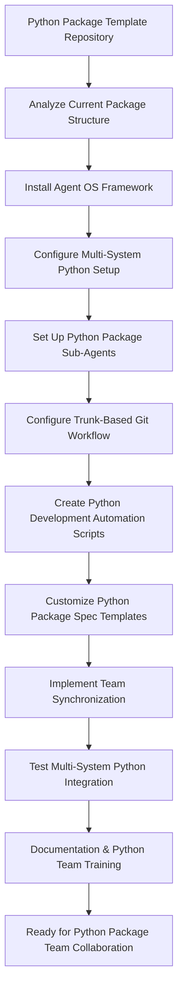

# Spec Requirements Document

> Spec: Agent OS Integration for Python Package Template
> Created: 2025-07-31
> Status: Planning

## Executive Summary

**Prompt for Future Reuse:**
```
Set up buildermethods Agent OS (https://github.com/buildermethods/agent-os) for this Python package template repository with comprehensive team collaboration features. Execute the following implementation with logical task dependency ordering:

TASK DEPENDENCY ORDERING STANDARD:
- All implementation tasks must follow logical dependency ordering where prior tasks are always applicable (if logical) to subsequent tasks
- Each task builds upon the achievements of previous tasks
- Task dependencies must be explicitly documented
- Foundation tasks (like system installation) come before dependent tasks (like analysis or configuration)
- This ordering minimizes errors, reduces rework, and ensures consistent implementation success across different team members and environments

IMPLEMENTATION STEPS:

1. INSTALL AGENT OS WITH MULTI-SYSTEM CONFIGURATION:
   Prerequisites: None - Foundation task
   - Install the framework at system level for Windows, Linux, macOS, or Unix
   - Configure system-level paths, environment variables, and shell integration
   - Set up cross-platform compatibility and OS-specific shell integration
   - Validate system installation with cross-platform compatibility tests

2. ANALYZE EXISTING PYTHON PACKAGE TEMPLATE:
   Depends on: Task 1 - System installation required to run @analyze-product
   - Run: @analyze-product "I want to install Agent OS in this Python package template"
   - Document current structure, packaging patterns, and development workflow
   - Identify integration points for the framework within Python package development
   - Create comprehensive analysis report for template integration

3. REPOSITORY INTEGRATION AND CONFIGURATION:
   Depends on: Task 2 - Analysis results guide repository configuration
   - Install and configure the framework in this repository based on analysis results
   - Create .agent-os directory structure optimized for Python package development
   - Configure repository-level settings for multi-system team synchronization
   - Always use /create-spec for specs and user stories

4. PYTHON PACKAGE DEVELOPMENT SUB-AGENTS CONFIGURATION:
   Depends on: Task 3 - Repository structure and settings required for sub-agents
   - development-agent.md: Python package development workflows with pyproject.toml patterns
   - testing-agent.md: Python testing frameworks (pytest) and package validation
   - deployment-agent.md: PyPI publishing and package distribution automation
   - Configure sub-agents for cross-system Python development synchronization

5. TRUNK-BASED GIT DEVELOPMENT WORKFLOW FOR PYTHON PACKAGES:
   Depends on: Task 4 - Sub-agents provide the automation foundation for git workflows
   - Configure trunk-based git development workflow for each Python package feature
   - Set up automated branching and merge workflows for package development
   - Implement feature flags for continuous package integration support

6. OS-SPECIFIC PYTHON DEVELOPMENT AUTOMATION SCRIPTS:
   Depends on: Task 5 - Git workflow structure required before creating automation scripts
   - create-spec-branch.sh: Automated spec branch management for Python features
   - sync-team-state.sh: Cross-system Python development environment synchronization
   - merge-spec-completion.sh: Automated spec completion workflows for package features
   - Create OS-specific versions for Windows PowerShell, Linux/Unix bash, and macOS zsh/bash
   - python-dev-tasks.sh: Python package development task automation (testing, building, publishing)

7. ENHANCED SPEC TEMPLATES FOR PYTHON PACKAGE DEVELOPMENT:
   Depends on: Task 6 - Automation scripts inform template workflow integration
   - Store all specs in .agent-os/specs/ folder with date-based naming
   - Include executive summary in every spec with original prompt and mermaid flowcharts
   - Modify spec templates for Python package development patterns (features, tests, documentation)
   - Ensure prompt completeness and self-containment for any Python development team

8. TEAM SYNCHRONIZATION FEATURES FOR PYTHON DEVELOPMENT:
   Depends on: Task 7 - Templates and workflows must be established before team synchronization
   - Configure project-level and user-level settings for Python development environments
   - Implement cross-system state synchronization for Python package development
   - Enable consistent behavior across different Python development environments (virtual environments, IDEs)
   - Support distributed team collaboration with trunk-based Python package development

9. TESTING AND VALIDATION FOR PYTHON PACKAGE TEMPLATE:
   Depends on: Task 8 - All components must be implemented before comprehensive testing
   - Write comprehensive tests for system-level installation across all supported operating systems
   - Test OS-specific installation scenarios (Windows, Linux, macOS, Unix) with Python environments
   - Test complete multi-system workflow from spec creation to package feature completion
   - Validate team synchronization and sub-agent functionality across different Python development environments

10. DOCUMENTATION AND TEAM TRAINING FOR PYTHON PACKAGE DEVELOPMENT:
    Depends on: Task 9 - System must be tested and validated before documentation and training
    - Document system-level installation procedures for all supported operating systems with Python setup
    - Update documentation with comprehensive workflow instructions for Python package development
    - Create team training documentation for new trunk-based Python package development workflow
    - Provide multi-system setup guide for distributed Python development team members
    - Create reusable implementation guide that can be applied to other Python package repositories

DELIVERABLES:
- Fully integrated Agent OS system with multi-platform Python development support
- Custom spec templates optimized for Python package development with executive summaries and mermaid flowcharts
- Cross-platform Python development automation scripts (testing, building, publishing)
- Multi-system team synchronization capabilities for Python package development
- Comprehensive documentation and training materials for Python package development workflows
- Established task dependency ordering framework for future Python package implementations

This setup enables your Python development team to use Agent OS for structured, synchronized, and automated Python package development workflows across multiple systems and team members with logical task dependencies that ensure implementation success.
```

**Process Flow:**


## Overview

Integrate Agent OS development framework into this Python package template repository to enable multi-system team collaboration with trunk-based development, automated Python development workflows, and synchronized sub-agents. This integration will provide structured spec creation, task management, and standardized documentation processes optimized for Python package development teams using modern Python tooling (pyproject.toml, uv, pytest).

## User Stories

### Python Package Development Team Collaboration

As a Python developer working on package templates across multiple systems, I want to use Agent OS with trunk-based development and automated Python development scripts, so that I can collaborate seamlessly with team members while maintaining consistent Python package development workflows and synchronized states using modern Python tooling.

**Detailed Workflow:**
1. Developer creates new Python package feature spec using `/create-spec` command
2. The system automatically creates trunk-based git branch for this Python package feature
3. Sub-agents are configured in .agent-os folder for Python development team synchronization
4. Python development scripts automate testing, building, and PyPI publishing tasks
5. All team members work on main branch with feature flags and continuous Python package integration
6. Spec completion automatically merges changes and updates the package development state

### System-Level Agent OS Installation for Python Development

As a Python developer setting up this package template on my system, I want Agent OS to be properly installed at the system level for my operating system with Python development support, so that I can use the framework consistently regardless of whether I'm on Windows, Linux, macOS, or Unix, with all Python development commands and tools properly configured for my environment.

**Detailed Workflow:**
1. System detects current operating system (Windows, Linux, macOS, Unix) and Python environment
2. Downloads and installs appropriate Agent OS system components for the OS with Python integration
3. Configures system-level paths, environment variables, and shell integration for Python development
4. Sets up OS-specific Python development environment and virtual environment management
5. Validates installation with cross-platform compatibility tests including Python package workflows
6. Enables seamless `/create-spec` and other Agent OS commands across all supported platforms with Python development support

### Python Package Template Management

As a maintainer of this Python package template, I want Agent OS to provide multi-system synchronization with standardized spec creation for Python package features, so that distributed team members can work consistently on package template improvements regardless of their development environment while maintaining full traceability of Python development patterns and decisions.

**Detailed Workflow:**
1. Team member creates Python package feature spec using standardized `/create-spec` process
2. Executive summary captures original prompt for future Python package template reference
3. Mermaid flowcharts visualize Python package development processes and workflow interactions
4. Sub-agents ensure consistent behavior across all team Python development systems
5. Trunk-based development enables continuous integration without branch conflicts for package features
6. Python development automation handles routine testing, building, and publishing tasks

## Spec Scope

1. **Task Dependency Ordering Requirement** - All implementation tasks must follow logical dependency ordering where prior tasks are always applicable (if logical) to subsequent tasks, ensuring each step builds upon previous achievements
2. **System-Level Agent OS Installation** - Install and configure the framework at system level for Windows, Linux, macOS, and Unix environments with Python development support
3. **Repository Integration** - Install and configure the framework in this Python package template using @analyze-product approach (depends on system installation)
4. **Python Package Sub-Agents Configuration** - Set up repository sub-agents in .agent-os folder for Python development team synchronization using modern Python tooling (depends on repository integration)
5. **Trunk-Based Git Development** - Configure trunk-based development workflow for each Python package feature with automated branching (depends on sub-agents)
6. **Cross-Platform Python Development Automation** - Create OS-specific scripts for Python development, testing, building, and publishing automation (depends on git workflow)
7. **Multi-System Team Synchronization** - Implement system-level configurations for consistent Python development team collaboration across different operating systems (depends on automation scripts)
8. **Enhanced Python Package Spec Templates** - Modify templates to include executive summary with prompt capture and mermaid diagrams optimized for Python package development (depends on synchronization setup)

## Out of Scope

- Modification of existing Python package functionality or core template structure
- Changes to the current Python build system, package configuration, or distribution methods
- Integration with external Python package management tools beyond Agent OS
- Custom Python package features beyond the specified Agent OS customizations
- Python version-specific implementations (the solution should work with modern Python 3.8+)

## Expected Deliverable

1. **Fully Integrated Python Development System** - Agent OS framework successfully installed and configured in this Python package template repository
2. **Custom Python Package Spec Templates** - Modified templates that automatically include executive summary sections with reusable prompts and mermaid flowcharts optimized for Python development
3. **Updated Python Development Workflow** - Team can use `/create-spec` command to generate structured specifications that work with Python package development patterns
4. **Logical Task Dependency Framework** - Established pattern of task ordering where each step builds upon previous achievements for maximum efficiency and reduced errors in Python development
5. **Reusable Python Package Implementation Guide** - Complete documentation that enables this setup to be replicated in other Python package repositories

## Future Spec Requirements

**Executive Summary Prompt Completeness Standard**: All specs created using Agent OS must include a complete, self-contained "Prompt for Future Reuse" in the executive summary that:
- Contains all necessary information for any Python development team to implement without external references
- Includes the Task Dependency Ordering Standard as defined below
- Documents all implementation steps with explicit dependencies
- Lists all expected deliverables and outcomes
- Uses generic language (pronouns, common nouns) for repository adaptability
- Provides sufficient context for successful implementation across different Python development environments

**Task Dependency Ordering Standard**: All future specs created using Agent OS must follow the logical dependency ordering principle established in this specification, where:
- Prior tasks are always applicable (if logical) to subsequent tasks
- Each task builds upon the achievements of previous tasks
- Task dependencies are explicitly documented in both the prompt and task sections
- Foundation tasks (like system installation) come before dependent tasks (like analysis or configuration)
- This ordering minimizes errors, reduces rework, and ensures consistent implementation success across different team members and environments

## Spec Documentation

- Tasks: @.agent-os/specs/2025-07-31-agent-os-integration/tasks.md
- Technical Specification: @.agent-os/specs/2025-07-31-agent-os-integration/sub-specs/technical-spec.md
- Tests Specification: @.agent-os/specs/2025-07-31-agent-os-integration/sub-specs/tests.md